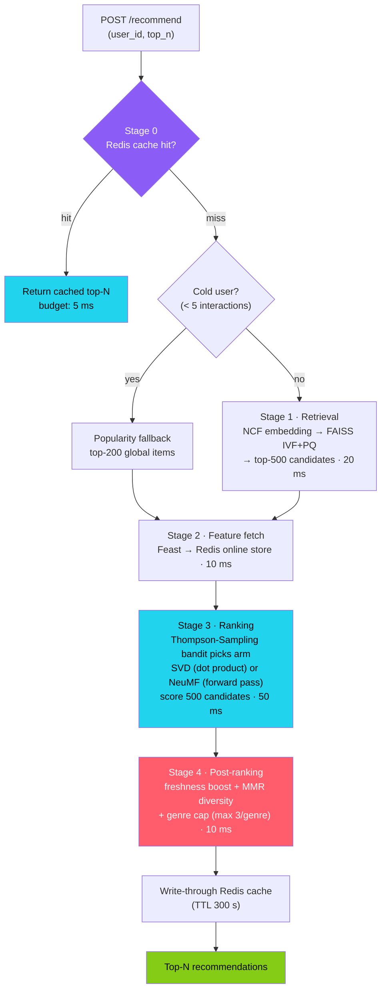
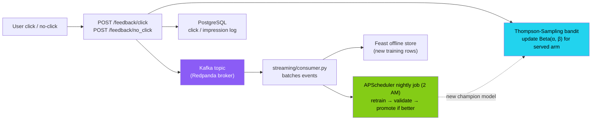
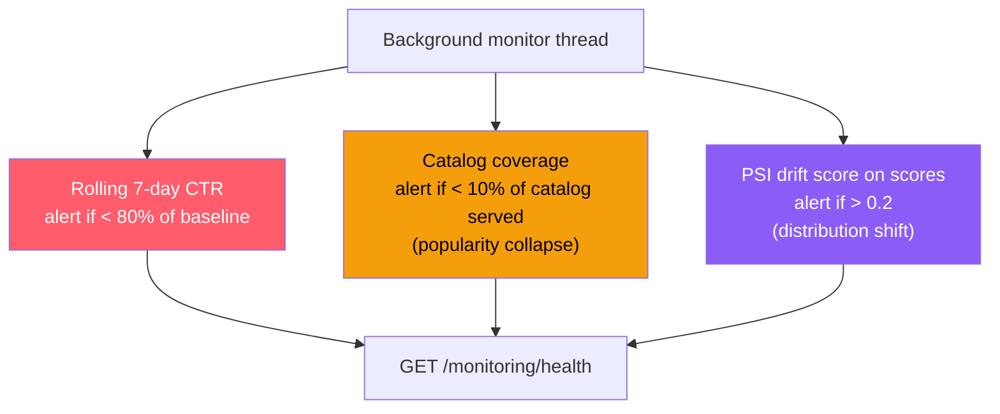
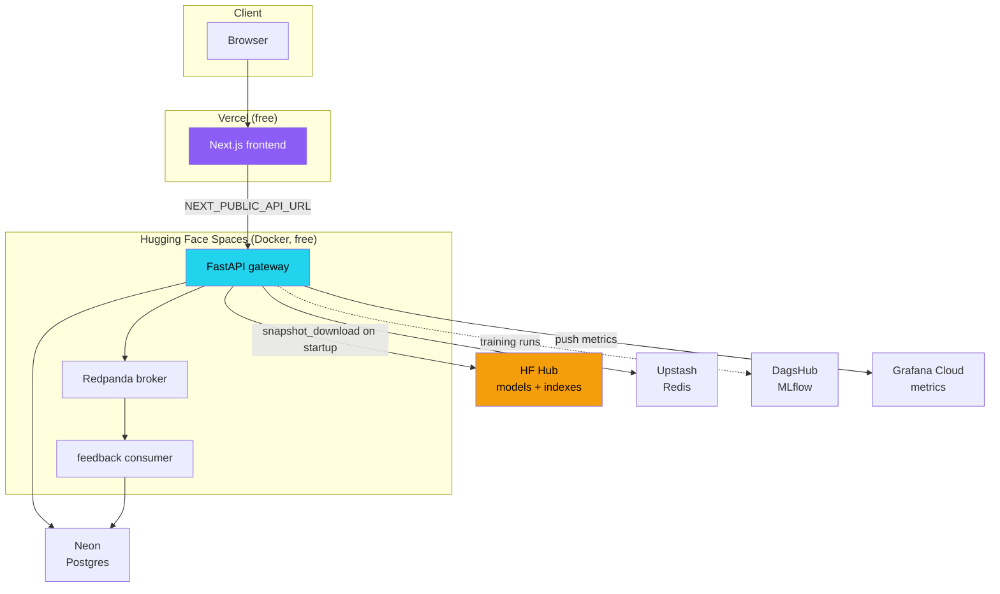

# Real-Time Recommendation Engine

> A two-stage, bandit-routed movie recommender served behind a latency-budgeted FastAPI gateway — deployed live, end-to-end, on free-tier infrastructure.

[](https://github.com/shiva-shivanibokka/ML-System-Design-Recommendation-Engine/actions/workflows/ci.yml)
[](./LICENSE)


**🎬 Live demo:** **https://ml-system-design-recommendation-eng.vercel.app**

---

## Recruiter TL;DR

- **What it is** — A production-shaped recommendation system that answers the classic FAANG ML-system-design interview question ("design YouTube/Netflix recommendations") with *running code*: a 5-stage serving pipeline (cache → ANN retrieval → feature fetch → model ranking → business re-ranking), a live A/B bandit, and a closed feedback loop that retrains nightly.
- **Hardest problem solved** — Ranking a deep neural model over a full catalog in under 100 ms is impossible, so retrieval and ranking are split: FAISS approximate-nearest-neighbor narrows 3,533 items to ~500 candidates, then NeuMF/SVD only re-rank that shortlist. A Thompson-Sampling bandit routes live traffic between the two models and shifts toward the winner automatically.
- **Impact** — Deployed **fully live on permanent free tiers** (Vercel + Hugging Face Spaces + Upstash + Neon + DagsHub + Grafana Cloud). NeuMF reaches **HR@10 0.67 / NDCG@10 0.449** on MovieLens-1M (leave-one-out, sampled-negatives protocol); 61 automated tests run in CI on every push.

---

## Overview — Problem & Motivation

Most "recommendation system" portfolio projects are a single notebook that fits a matrix-factorization model and prints `precision@k`. That is not what a recommender *is* in production — the model is maybe 10% of the system. The other 90% is the parts that make it serve traffic in real time, stay fresh, and not silently rot.

This project is built to demonstrate that other 90%, to the architectural standard used by Netflix, Spotify, and YouTube, and to be defensible line-by-line in an interview. It deliberately implements the pieces that separate a demo from a system:

- **Two-stage retrieval** because you cannot run a neural network over every item on every request.
- **A feature store** (Feast) because training features and serving features drifting apart is the single most common silent failure in production ML.
- **A multi-armed bandit** instead of a fixed A/B split, because a fixed split keeps paying half your traffic to the losing model long after you know it's losing.
- **Three independent staleness signals** because models decay quietly, and "it looked fine" is how recommenders collapse into recommending the same ten popular items to everyone.

**Audience:** this is a portfolio / interview piece. It is optimized for being *understood and defended*, not for scale — the design notes throughout call out explicitly what would change at 100M users.

---

## Live Demo

| Surface | URL |
|---|---|
| Frontend (Next.js on Vercel) | **https://ml-system-design-recommendation-eng.vercel.app** |
| API gateway (FastAPI on HF Spaces) | Interactive OpenAPI docs at `/docs` on the gateway host |

The frontend has four pages: **Recommend** (get top-N for any user with plain-language explanations), **Bandit** (live Thompson-Sampling traffic split and per-arm reward), **Monitoring** (CTR / catalog-coverage / drift signals), and **Catalog** (a 2-D t-SNE projection of the learned item-embedding "galaxy").

> ⚠️ The gateway runs on a free Hugging Face Space that **sleeps after ~48 h of inactivity**. The first request after it sleeps takes ~30–60 s to cold-start; subsequent requests are fast.

---

## Architecture

### Request path — the 5-stage serving pipeline

Every `POST /recommend` flows through a latency-budgeted pipeline. The budgets (right-hand column) are enforced with per-stage Prometheus histograms; the total target is p99 < 100 ms, the Netflix/YouTube serving standard.



**Why this shape?** Retrieval and ranking have opposite cost/accuracy profiles. FAISS is cheap and approximate — perfect for cutting 3,533 items down to a few hundred. NeuMF is expensive and accurate — affordable only on that shortlist. Splitting them is what makes a deep model viable inside a 100 ms budget. (See [ADR 001](docs/adr/001-two-stage-retrieval.md).)

### Feedback loop — how the system stays fresh



Clicks do two things at once: they update the bandit's belief about which model is winning *right now* (fast loop), and they flow through Kafka into the feature store to become tomorrow's training data (slow loop). A nightly job retrains, validates against the current champion, and only promotes a challenger that actually beats it.

### Staleness detection — three independent alarms

A background thread continuously watches for the three ways a recommender rots. Any one tripping is a signal that the model needs attention:



---

## What makes this different from a simple recsys

| System-design problem | Solution implemented |
|---|---|
| Can't run a neural model over all items in < 100 ms | Two-stage: FAISS ANN → top-500 → NeuMF re-ranks the shortlist |
| New users have no history | Cold-start routing → popularity fallback (top-200 global) |
| Fixed A/B keeps paying traffic to the worse model | Thompson-Sampling bandit auto-shifts to the winning arm |
| Top results are all the same genre | MMR diversity re-ranking (λ=0.7) + hard genre cap (3/genre) |
| Training features ≠ serving features | Feast: one feature definition, offline + online store |
| Models decay silently in production | 3-signal staleness detection: CTR + coverage + PSI drift |
| Static model, never improves | Kafka → Feast feedback loop → nightly retrain-and-promote |
| No latency visibility | Per-stage Prometheus histograms + explicit budget per stage |

---

## Models & Evaluation

Two collaborative-filtering models serve as the bandit's two arms. Both are evaluated with the **identical** protocol — leave-one-out with sampled negatives (the NeuMF-paper protocol) — so their numbers are directly comparable.

| Model | Family | HR@10 | NDCG@10 | Role |
|---|---|---|---|---|
| **NeuMF** | Neural CF (GMF + MLP, 64-dim) | **0.670** | **0.449** | Arm B — deep, non-linear, higher accuracy |
| **SVD** | Matrix factorization (TruncatedSVD, 128 comp.) | 0.629 | 0.378 | Arm A — fast linear baseline (dot-product scoring) |

*Evaluated on MovieLens-1M: 6,040 users, 3,533 items with interactions. Metrics are read live from the gateway's `/model/metrics` endpoint and stored in `models/metrics.json`.*

- **NeuMF** — GMF path (element-wise embedding product) + MLP path (concatenate → deep layers). Its GMF item embeddings are extracted and indexed in FAISS to power Stage-1 retrieval; the full forward pass re-ranks Stage-3 candidates.
- **SVD** — a deliberately cheap baseline. It exists so the bandit has something to compare against, and so the system degrades gracefully when the deep model offers no lift.
- **FAISS IVF+PQ** — 3,533 item vectors (64-dim), IVF256 + PQ16, ~20 ms ANN retrieval. Query = user's GMF embedding → top-500 nearest items. (See [ADR 003](docs/adr/003-faiss-ivfpq.md).)

---

## Tech Stack

| Layer | Technology | Why |
|---|---|---|
| API serving | FastAPI 0.111 + Uvicorn | Async, native OpenAPI docs, Pydantic validation |
| Models | PyTorch 2.3 (NeuMF), scikit-learn 1.4 (SVD) | Deep model + cheap comparable baseline |
| Stage-1 retrieval | FAISS 1.8 (IVF+PQ) | Sub-linear ANN search; scales to billions of vectors |
| A/B routing | Thompson Sampling (custom) | Regret-minimizing — beats a fixed split |
| Feature store | Feast 0.40 (offline: files, online: Redis) | One definition → kills training/serving skew |
| Cache & online store | Redis (Upstash in prod) | < 5 ms feature + recommendation lookups |
| Database | PostgreSQL (Neon in prod) | Durable click / impression log |
| Event streaming | Kafka — Redpanda broker embedded in prod | Decouples ingestion from serving |
| Scheduling | APScheduler | Nightly retrain-and-promote job |
| Experiment tracking | MLflow (DagsHub-hosted in prod) | Run history, metrics, model registry |
| Monitoring | Prometheus + Grafana (Grafana Cloud in prod) | Per-stage latency + staleness dashboards |
| Structured logging | structlog (JSON) | Machine-parseable request logs |
| LLM explanations | Google Gemini Flash (optional) | Natural-language "why this movie" copy |
| Frontend | Next.js 14 + Tailwind + shadcn/ui + Recharts | App-router SPA, deployed on Vercel |
| Containerization | Docker + docker-compose | Reproducible local full stack |

Pinned versions live in [`requirements.txt`](requirements.txt) (runtime) and [`requirements-dev.txt`](requirements-dev.txt) (adds the test runner) for Python, and [`frontend/package.json`](frontend/package.json) for JS.

---

## Skills Demonstrated

- **Production ML deployment / MLOps** — model serving cleanly separated from training; artifacts pulled from a model registry (HF Hub) at startup; nightly retrain-validate-promote loop.
- **System design & architecture** — latency-budgeted two-stage pipeline with documented tradeoff reasoning (three ADRs), each design choice defensible against its rejected alternative.
- **RESTful API design** — 13 typed FastAPI endpoints (recommendations, feedback, bandit state, monitoring, metrics) with request/response validation and generated OpenAPI docs.
- **Data engineering / ETL** — MovieLens raw → processed features → offline/online feature store; a streaming path that turns live clicks into future training rows.
- **Asynchronous / event-driven systems** — Kafka-decoupled feedback ingestion, background monitor thread, async serving.
- **Observability & monitoring** — structured JSON logging, health endpoints, per-stage Prometheus histograms, three drift/staleness alarms pushed to Grafana Cloud.
- **Cloud deployment** — a full multi-service system deployed live across six managed free tiers (Vercel, Hugging Face Spaces, Upstash, Neon, DagsHub, Grafana Cloud).
- **CI/CD** — GitHub Actions runs 61 unit + integration tests and a Docker build-verification on every push to `main`.

---

## Project Structure

```
├── serving/                 # FastAPI gateway — the live system
│   ├── main.py              #   5-stage pipeline + all 13 endpoints
│   ├── bandit.py            #   Thompson-Sampling A/B router (Beta distributions)
│   ├── post_ranking.py      #   MMR diversity + freshness + genre cap
│   ├── cold_start.py        #   popularity / content fallbacks for new users & items
│   ├── monitoring.py        #   CTR / coverage / PSI-drift staleness signals
│   ├── explain.py           #   Gemini-Flash (or template) recommendation explanations
│   ├── artifacts.py         #   downloads models + indexes from HF Hub on startup
│   └── metrics_push.py      #   pushes Prometheus metrics to Grafana Cloud
├── training/                # Model training (run on a GPU laptop)
│   ├── ncf_model.py         #   NeuMF (GMF + MLP)
│   ├── svd_model.py         #   TruncatedSVD baseline
│   └── train.py             #   trains both, builds the FAISS index (--model all)
├── streaming/               # Kafka feedback path (renamed from kafka/ to avoid shadowing)
│   ├── producer.py          #   simulate user-interaction events
│   └── consumer.py          #   consume clicks → Feast offline store + nightly retrain
├── feature_store/           # Feast 0.40 feature repo + materialization
├── scripts/                 # download_movielens.py, build_embedding_map.py (t-SNE)
├── frontend/                # Next.js 14 app (Recommend / Bandit / Monitoring / Catalog)
├── configs/                 # config.yaml (all hyperparameters) + settings.py (env parsing)
├── monitoring/              # Prometheus config + Grafana dashboards & datasources
├── docs/
│   ├── adr/                 # 3 Architecture Decision Records
│   └── deployment/DEPLOY.md # full free-tier deployment runbook
├── tests/                   # 61 unit + integration tests (run in CI)
├── gradio_app/              # legacy Gradio demo — superseded by the Next.js frontend
├── Dockerfile               # local / docker-compose image
├── Dockerfile.space         # HF Spaces image (embeds Redpanda broker)
├── docker-compose.yml       # full local stack (kafka, redis, postgres, mlflow, grafana...)
└── Makefile                 # setup / serve / test / docker-up / frontend-* targets
```

---

## Getting Started (local)

### Prerequisites
- Python 3.11
- Node.js 18+ (only for the frontend)
- Docker + Docker Compose (only for the full-stack path)

### 1. Install and configure

```bash
git clone https://github.com/shiva-shivanibokka/ML-System-Design-Recommendation-Engine.git
cd ML-System-Design-Recommendation-Engine

python -m pip install -r requirements.txt

cp .env.example .env          # then set POSTGRES_PASSWORD and GRAFANA_PASSWORD
```

### 2. Get data and train the models

The gateway needs trained artifacts (`models/`, `data/indexes/`, `data/processed/`) before it can serve. Generate them with the two verified commands below (training on a GPU is fastest but CPU works for MovieLens-1M):

```bash
python scripts/download_movielens.py      # → data/raw
python training/train.py --model all      # → models/svd, models/ncf, data/indexes, data/processed
```

> The `train.py --model all` run also builds the FAISS IVF+PQ index. Optionally run
> `python scripts/build_embedding_map.py` to generate the 2-D t-SNE catalog projection used by the frontend.

### 3. Register features (optional, for the Feast path)

```bash
cd feature_store/feature_repo && feast apply && cd -
make feast-materialize        # syncs offline features → Redis online store
```

### 4. Run it

**Option A — API only (fastest):**
```bash
make serve                    # uvicorn serving.main:app on http://localhost:8000
```

**Option B — full stack with docker-compose** (Kafka, Redis, Postgres, MLflow, Prometheus, Grafana):
```bash
make docker-up                # requires .env; brings up every service
```

| Service | URL |
|---|---|
| FastAPI docs | http://localhost:8000/docs |
| MLflow | http://localhost:5001 |
| Prometheus | http://localhost:9090 |
| Grafana | http://localhost:3000 (admin / `GRAFANA_PASSWORD`) |

**Frontend:**
```bash
make frontend-install
make frontend-dev             # Next.js on http://localhost:3001 (set NEXT_PUBLIC_API_URL=http://localhost:8000)
```

---

## Usage

All endpoints are typed and self-documented at `/docs`. The core ones:

**Get recommendations**
```bash
curl -X POST http://localhost:8000/recommend \
  -H "Content-Type: application/json" \
  -d '{"user_id": 1, "top_n": 10}'
```

**Get recommendations with natural-language explanations** (Gemini Flash if `GEMINI_API_KEY` is set, else templated)
```bash
curl "http://localhost:8000/recommend/1/explain?top_n=5"
```

**Register a click** (updates the Thompson-Sampling bandit + logs to Postgres + emits to Kafka)
```bash
curl -X POST http://localhost:8000/feedback/click \
  -H "Content-Type: application/json" \
  -d '{"request_id": "...", "user_id": 1, "item_id": 1196, "model_used": "ncf", "rank_shown": 1}'
```

**Inspect the live bandit / model / monitoring state**
```bash
curl http://localhost:8000/bandit/state          # per-arm Beta(α,β) + current traffic split
curl http://localhost:8000/model/metrics         # HR@10 / NDCG@10 for both arms
curl http://localhost:8000/monitoring/health      # CTR / coverage / PSI staleness signals
curl http://localhost:8000/catalog/embedding_map  # 2-D t-SNE item projection
```

**Full endpoint list:** `POST /recommend`, `GET /recommend/{user_id}/explain`, `POST /feedback/click`, `POST /feedback/no_click`, `GET /bandit/state`, `POST /admin/bandit/reset`, `GET /model/metrics`, `GET /catalog/embedding_map`, `GET /monitoring/health`, `GET /monitoring/latency`, `GET /metrics` (Prometheus), `GET /health`, `GET /`.

**Simulate a stream of user events** (Kafka producer):
```bash
python streaming/producer.py --n-events 1000 --rate 10
```

---

## Deploy From Scratch (free-tier, fully live)

This reproduces the live deployment using **only permanent free tiers**. Full runbook with every command: [`docs/deployment/DEPLOY.md`](docs/deployment/DEPLOY.md).

### Topology



### Provisioning order

| # | Step | Host |
|---|---|---|
| 1 | Train models locally (`train.py --model all`) | Your GPU laptop |
| 2 | Upload `models/`, `data/indexes/`, `data/processed/` to an HF Hub model repo | Hugging Face Hub |
| 3 | Create Redis, Postgres, MLflow, Grafana instances; copy their connection secrets | Upstash / Neon / DagsHub / Grafana Cloud |
| 4 | Create a **Docker** Space, add all secrets, `git push space main` | Hugging Face Spaces |
| 5 | Import the repo on Vercel with **Root Directory = `frontend`**, set `NEXT_PUBLIC_API_URL` to the Space URL | Vercel |
| 6 | Set the Space secret `CORS_ORIGINS` to the Vercel URL, restart | — |

### Secret / env-var reference

Set these as **Hugging Face Space secrets** on the gateway (all read via env vars — nothing is committed; unset values degrade gracefully instead of crashing):

| Name | Provider | Notes |
|---|---|---|
| `HF_MODEL_REPO` | HF Hub | `<user>/recsys-artifacts` |
| `HF_TOKEN` | HF | read token (only needed for a private artifact repo) |
| `REDIS_URL` | Upstash | `rediss://default:<pw>@<host>.upstash.io:6379` |
| `DATABASE_URL` | Neon | `postgresql://<user>:<pw>@<host>/<db>?sslmode=require` |
| `MLFLOW_TRACKING_URI` / `_USERNAME` / `_PASSWORD` | DagsHub | hosted MLflow + token |
| `GRAFANA_PUSH_URL` / `_USER` / `_KEY` | Grafana Cloud | Prometheus remote-write endpoint + instance id + API key |
| `CORS_ORIGINS` | — | the exact Vercel URL |
| `NEXT_PUBLIC_API_URL` | — | set on **Vercel** = the Space URL |

---

## Testing

61 unit + integration tests cover the bandit math, post-ranking (MMR/freshness/genre-cap), cold-start routing, settings/env parsing, artifact download, metrics push, and the API surface.

```bash
python -m pip install -r requirements-dev.txt   # runtime deps + pytest
make test
# or directly:
python -m pytest tests/unit/ -v
python -m pytest tests/integration/ -v
```

The test runner lives in [`requirements-dev.txt`](requirements-dev.txt), not
`requirements.txt`, so the serving image stays free of it. Installing only the
runtime file and then running `pytest` fails with `No module named pytest` —
which is precisely what CI did, silently, from 2026-07-02 until it was fixed.

CI ([`.github/workflows/ci.yml`](.github/workflows/ci.yml)) runs the full suite on Python 3.11 **and** verifies the Docker image builds, on every push and PR to `main`.

---

## Design Decisions (ADRs)

Full reasoning — including the alternatives considered and rejected — lives in [`docs/adr/`](docs/adr/):

- [**ADR 001** — Two-Stage Retrieval](docs/adr/001-two-stage-retrieval.md): why FAISS ANN feeds a model re-ranker instead of scoring the full catalog.
- [**ADR 002** — Thompson Sampling](docs/adr/002-thompson-sampling.md): why a bandit beats a fixed A/B split for model routing.
- [**ADR 003** — FAISS IVF+PQ](docs/adr/003-faiss-ivfpq.md): index-type and parameter choices (IVF256, PQ16, nprobe=32).

**Academic references:** NeuMF (He et al., WWW 2017) · Two-stage retrieval (Covington et al., RecSys 2016) · Thompson Sampling (Chapelle & Li, NeurIPS 2011) · MMR diversity (Carbonell & Goldstein, SIGIR 1998).

---

## Roadmap / Known Limitations

Honest state of the project — these are deliberately scoped out, not hidden:

- **Feast Stage-2 features are fetched but not yet fused into ID-based ranking.** The feature-store path is wired end-to-end (offline + online), but the current SVD/NeuMF rankers score on IDs; joining the fetched user/item features into the ranker is the natural next step.
- **Content-based cold-start for *new items* is a stub.** New *users* get a working popularity fallback; the genre-embedding cosine fallback for brand-new items is scaffolded but not fully wired.
- **Latency figures are design budgets, not a load-tested SLA.** Per-stage budgets are enforced via Prometheus histograms, but no formal load test has been run to certify a production p99.
- **The HF Space is ephemeral.** Its embedded Kafka broker and consumer reset when the free Space sleeps or rebuilds; the local `docker-compose` stack remains the "true distributed" reference for the streaming path.

---

## License

Released under the [MIT License](./LICENSE).
